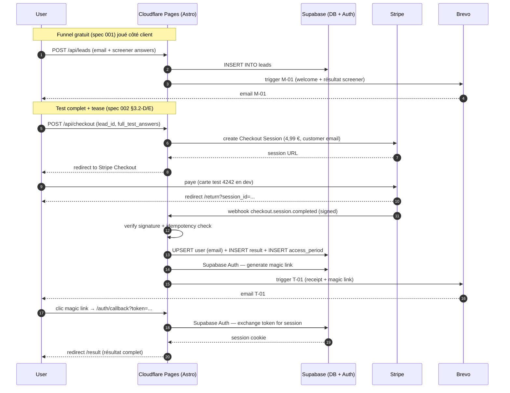

# 004 — Authentification, paiement & emails de cycle de vie

- **Statut** : proposé
- **Date** : 2026-05-18
- **Remplace** : aucune. Implémente techniquement les décisions produit
  arrêtées en **spec 002**.
- **Périmètre** : auth (Supabase), paiement (Stripe Checkout + Tax),
  emails (Brevo), persistance des résultats et des leads, conformité RGPD.
  Cette spec ne touche pas au dashboard utilisateur ni à l'historique des
  tests (→ spec 005).

---

## 1. Intention

Transformer le funnel anonyme du MVP (spec 001) en un funnel monétisé et
identifié, conforme aux décisions de 002 :

- capture progressive d'email après le screener
- paiement à l'unité à 4,99 € TTC via Stripe Checkout
- création de compte automatique après paiement
- accès aux résultats pendant 12 mois via lien email (magic link)
- relances de cycle de vie automatisées (abandon, pré-expiration)
- suppression de compte et export de données sur demande (RGPD)

## 2. Décisions techniques figées

| Choix | Décision | Justification |
|---|---|---|
| Auth | **Supabase Auth + magic link only V1** | Pas de mot de passe à gérer / oublier ; UX minimale ; Supabase gère token, expiry, rate-limit |
| Création de compte | **Automatique au paiement** (jamais en amont) | Pas de friction inutile ; tous les comptes V1 sont nécessairement des acheteurs |
| DB | **Supabase Postgres EU (région eu-west)** | Co-localisé avec Brevo (FR) ; conforme RGPD ; intégration native avec Supabase Auth |
| Paiement | **Stripe Checkout hébergé** + Stripe Tax | Conformité TVA UE automatique ; pas de PCI scope ; pas de skin custom V1 |
| Devise | **EUR uniquement V1** | Marché FR-first |
| Email | **Brevo (transactionnel + automation)** | Choix arrêté en 002 §5.2 |
| Sécurité webhook | **Signature Stripe vérifiée + idempotency table** | Standard Stripe ; protège contre replay |
| Accès résultats | **Magic link Supabase** envoyé par email à chaque session | Pas de cookie permanent ; pas de password ; lien valide 1 h après envoi |
| Validité produit | **`access_expires_at = now + 12 mois`** stocké sur `access_periods` | Source de vérité unique |

## 3. Architecture data flow



## 4. Schéma base de données (Supabase Postgres)

### 4.1 Tables

```sql
-- Comptes utilisateur (créés au paiement)
create table public.users (
  id            uuid primary key default gen_random_uuid(),
  email         text unique not null,
  stripe_customer_id text unique,
  created_at    timestamptz not null default now(),
  updated_at    timestamptz not null default now(),
  deleted_at    timestamptz   -- soft delete RGPD
);

-- Résultats complets (1 par achat)
create table public.results (
  id                  uuid primary key default gen_random_uuid(),
  user_id             uuid not null references public.users(id) on delete cascade,
  asrs_answers        jsonb not null,
  contextual_answers  jsonb not null,
  screener_level      text not null check (screener_level in ('faible','modere','eleve')),
  full_result         jsonb not null,  -- FullResult shape (cf. src/lib/scoring.ts)
  created_at          timestamptz not null default now()
);
create index on public.results (user_id);

-- Périodes d'accès (12 mois post-paiement, 1 par achat)
create table public.access_periods (
  id                  uuid primary key default gen_random_uuid(),
  user_id             uuid not null references public.users(id) on delete cascade,
  result_id           uuid not null references public.results(id) on delete cascade,
  stripe_session_id   text unique not null,
  granted_at          timestamptz not null default now(),
  expires_at          timestamptz not null
);
create index on public.access_periods (user_id, expires_at);

-- Leads (emails capturés au mur, achetés ou non)
create table public.leads (
  id              uuid primary key default gen_random_uuid(),
  email           text not null,
  screener_answers jsonb,
  screener_level  text,
  utm             jsonb,           -- {source, medium, campaign, ...}
  captured_at     timestamptz not null default now(),
  converted_at    timestamptz,     -- ts du paiement si converti
  user_id         uuid references public.users(id) on delete set null
);
create index on public.leads (email, captured_at);

-- Idempotency webhook Stripe (anti-replay)
create table public.processed_webhooks (
  event_id     text primary key,
  source       text not null,      -- 'stripe' V1
  received_at  timestamptz not null default now()
);

-- Audit emails sortants
create table public.email_events (
  id           uuid primary key default gen_random_uuid(),
  user_id      uuid references public.users(id) on delete set null,
  lead_id      uuid references public.leads(id) on delete set null,
  template     text not null,      -- 'T-01', 'M-01', 'M-02', 'M-03/1', etc.
  brevo_message_id text,
  sent_at      timestamptz not null default now(),
  unsubscribed_at  timestamptz
);
create index on public.email_events (user_id, sent_at);
create index on public.email_events (lead_id, sent_at);
```

### 4.2 Row Level Security (RLS)

Toutes les tables sont en RLS **deny par défaut**. Accès via :

- **Service role key** (côté serveur Astro uniquement) : accès complet pour
  les opérations système (webhook handler, cron de purge).
- **Anon key + session JWT** (utilisateur connecté) : accès limité à ses
  propres lignes via policies SQL :
  - `users` : `id = auth.uid()`
  - `results` : `user_id = auth.uid()`
  - `access_periods` : `user_id = auth.uid()` en SELECT, jamais en write
  - `leads`, `processed_webhooks`, `email_events` : **aucun accès client**,
    service role uniquement.

## 5. Flow auth (magic link)

### 5.1 Premier accès post-paiement

1. Webhook Stripe crée le user + génère un magic link via Supabase Auth
   (`auth.admin.generateLink({ type: 'magiclink', email })`)
2. Brevo envoie T-01 contenant le magic link (valide 1 h)
3. User clique → `/auth/callback?token_hash=...&type=magiclink`
4. L'endpoint échange le token contre une session, pose le cookie HTTP-only,
   redirige vers `/result/:result_id`

### 5.2 Accès ultérieur dans les 12 mois

1. User retourne sur le site, va à `/login`
2. Entre son email → POST `/api/auth/request-magic-link`
3. Supabase Auth envoie un nouveau magic link
4. Click → session restaurée → `/result/:latest_result_id`

### 5.3 Expiration de l'accès

- Si `access_periods.expires_at < now()` pour tous les access_periods d'un
  user → la page `/result` affiche un message d'expiration et un CTA
  d'achat (4,99 € pour un nouveau test).
- Le compte reste, l'historique reste accessible (lecture seule) ;
  seul l'accès à un résultat *exploitable* est limité.

## 6. Flow paiement

### 6.1 Création de la session Checkout

Endpoint `POST /api/checkout` (server-rendered, Astro endpoint) :

```ts
// Pseudo-code, structure cible
export const POST: APIRoute = async ({ request }) => {
  const { lead_id, asrs_answers, contextual_answers } = await request.json();
  const lead = await sb.from('leads').select().eq('id', lead_id).single();
  if (!lead) return new Response('lead not found', { status: 404 });

  const session = await stripe.checkout.sessions.create({
    mode: 'payment',
    payment_method_types: ['card'],
    line_items: [{
      price: STRIPE_PRICE_ID_499,  // pré-créé dans Stripe dashboard, 4,99 € EUR
      quantity: 1,
    }],
    customer_email: lead.email,
    automatic_tax: { enabled: true },
    success_url: `${SITE_URL}/return?session_id={CHECKOUT_SESSION_ID}`,
    cancel_url: `${SITE_URL}/result/tease?lead_id=${lead_id}`,
    metadata: {
      lead_id,
      asrs_answers: JSON.stringify(asrs_answers),
      contextual_answers: JSON.stringify(contextual_answers),
    },
  });
  return new Response(JSON.stringify({ url: session.url }), { status: 200 });
};
```

**Note** : les `asrs_answers` et `contextual_answers` voyagent dans la
`metadata` de la session pour que le webhook puisse construire le
`full_result` côté serveur de façon déterministe — sans relancer le scoring
côté client (anti-tampering).

### 6.2 Webhook Stripe

Endpoint `POST /api/webhook/stripe` :

1. **Vérifie la signature** avec `stripe.webhooks.constructEvent(payload, sig, STRIPE_WEBHOOK_SECRET)`.
   Renvoie 400 si invalide.
2. **Idempotency** : `INSERT INTO processed_webhooks (event_id, source) VALUES (event.id, 'stripe')` ;
   si conflit unique → renvoie 200 immédiatement (déjà traité).
3. Si `event.type === 'checkout.session.completed'` :
   - Parse `metadata.lead_id`, `metadata.asrs_answers`, `metadata.contextual_answers`
   - Recalcule `full_result` via `scoreFull(...)` (déterministe, source de vérité côté serveur)
   - **UPSERT** user (`email = session.customer_email`)
   - **INSERT** result
   - **INSERT** access_period (`expires_at = now + interval '12 months'`)
   - Marque le lead comme converti (`converted_at = now`, `user_id = ...`)
   - **Supabase Auth** : `generateLink({ type: 'magiclink', email })`
   - **Brevo** : trigger T-01 (template id + params : magic_link, expires_at_human)
4. Renvoie 200.

**Tous les autres types d'event Stripe** sont logués mais ignorés V1
(extensible plus tard).

### 6.3 Page `/return`

- Reçoit `session_id` en query param.
- Affiche un loader *« Validation du paiement…»*
- Poll toutes les 1 s `GET /api/checkout/status?session_id=...` jusqu'à
  ce que l'access_period existe (max 10 s).
- Si OK → redirect vers `/auth/await-link` qui invite à vérifier sa boîte
  mail pour cliquer sur le magic link.
- Si timeout → message *« Votre paiement est enregistré, le mail arrivera
  dans quelques minutes. Vérifiez vos spams. »*

## 7. Flow emails (Brevo)

Configuration côté Brevo :

- **Templates** créés dans Brevo (T-01, M-01, M-02, M-03 ×3, M-04) avec
  variables `{{ params.X }}` pour les contenus dynamiques.
- **API REST** : envoi via `POST https://api.brevo.com/v3/smtp/email` avec
  `templateId` + `to` + `params`.
- **Workflows automation** pour M-02/M-03/M-04 : déclenchés via API event
  (`POST /v3/contacts/.../events`) qui pilote un scénario Brevo.

Insertion d'événements applicatifs côté Astro :

```ts
async function sendEmail(template: string, to: string, params: object, ids: {user_id?: string, lead_id?: string}) {
  const res = await fetch('https://api.brevo.com/v3/smtp/email', {
    method: 'POST',
    headers: { 'api-key': BREVO_API_KEY, 'content-type': 'application/json' },
    body: JSON.stringify({
      to: [{ email: to }],
      templateId: TEMPLATE_IDS[template],
      params,
    }),
  });
  const { messageId } = await res.json();
  await sb.from('email_events').insert({ template, brevo_message_id: messageId, ...ids });
}
```

**Lien de désinscription** : intégré dans chaque template Brevo (variable
natifs Brevo `{{ unsubscribe }}`). Le webhook Brevo `contact.unsubscribed`
met à jour `email_events.unsubscribed_at` et marque le user pour exclusion
des futures relances marketing.

## 8. Sécurité

| Surface | Contrôle |
|---|---|
| Webhook Stripe | Signature vérifiée, secret en env var. Réponse rapide (< 5 s) pour éviter retry. |
| Idempotency | Table `processed_webhooks` avec `event.id` en clé primaire. Replay tolerated. |
| Service role key Supabase | **Jamais** dans le bundle client. Importé uniquement depuis `src/pages/api/**/*.ts` (server-rendered). ESLint rule custom à ajouter pour bloquer l'import depuis `src/components/`. |
| Magic link | Token Supabase signé, expiry 1 h, single-use. |
| Session cookie | HTTP-only, SameSite=Lax, Secure (HTTPS only en prod). |
| CSRF | Webhook Stripe et Brevo : signature suffit. Endpoints internes utilisent Origin check + cookie session. |
| Rate limiting | V1 : reposé sur Cloudflare WAF / rate limiting natif (configurable dashboard). À monitorer. |

## 9. Conformité RGPD

### 9.1 Bases légales

| Donnée | Base légale | Durée de conservation |
|---|---|---|
| `users.email` | Exécution du contrat | Tant que le compte est actif. Soft delete sur demande. |
| `results.*` | Exécution du contrat | Idem. |
| `access_periods.*` | Exécution du contrat | 5 ans après expiration (preuve d'achat, obligations comptables). |
| `leads.*` (non convertis) | Intérêt légitime (relance achat) | **90 jours**, purge automatique via cron. |
| `email_events.*` | Intérêt légitime (preuve d'envoi, lutte démarchage abusif) | **3 ans**. |
| `processed_webhooks.*` | Intérêt légitime (anti-fraude) | **1 an**. |

### 9.2 Droits utilisateur

- **Droit à l'effacement** : endpoint `DELETE /api/account` (auth required)
  → soft delete immédiat (`users.deleted_at = now`), purge complète
  (cascade) sous 30 jours via cron. Anonymisation des `email_events`
  associés. Conservation des `access_periods` (obligations comptables)
  mais avec `user_id` mis à `null`.
- **Droit à la portabilité** : endpoint `GET /api/account/export`
  (auth required) → JSON de toutes les rows liées au user.
- **Procédure manuelle** : email `privacy@<domain>` documenté en
  politique de confidentialité (fallback pour requêtes complexes).

### 9.3 Cron jobs (Cloudflare Workers Cron Triggers)

| Cron | Fréquence | Action |
|---|---|---|
| `purge-leads` | Daily 03:00 UTC | Supprime `leads` où `captured_at < now - 90 days` AND `converted_at IS NULL` |
| `purge-deleted-users` | Daily 03:30 UTC | Hard delete des `users` avec `deleted_at < now - 30 days` |
| `purge-old-email-events` | Weekly Sunday 04:00 UTC | Supprime `email_events` où `sent_at < now - 3 years` |
| `purge-old-webhooks` | Weekly Sunday 04:30 UTC | Supprime `processed_webhooks` où `received_at < now - 1 year` |
| `trigger-M04` | Daily 09:00 UTC | Pour chaque access_period qui expire dans 14 j (puis dans 1 j), trigger M-04 si pas déjà envoyé |

## 10. Variables d'environnement

À ajouter au dashboard Cloudflare Pages (Production + Preview) et à
`.env.local` côté dev. **Aucune ne doit être commitée.**

| Clé | Description | Scope runtime |
|---|---|---|
| `PUBLIC_SUPABASE_URL` | URL projet Supabase | client + server |
| `PUBLIC_SUPABASE_ANON_KEY` | Clé anon (RLS-safe) | client + server |
| `SUPABASE_SERVICE_ROLE_KEY` | Clé admin Supabase | **server only** |
| `STRIPE_PUBLISHABLE_KEY` | Clé publique Stripe | client + server |
| `STRIPE_SECRET_KEY` | Clé secrète Stripe | **server only** |
| `STRIPE_WEBHOOK_SECRET` | Secret signature webhook | **server only** |
| `STRIPE_PRICE_ID_499` | ID du Price Stripe à 4,99 € | server only |
| `BREVO_API_KEY` | Clé API Brevo | **server only** |
| `BREVO_TEMPLATE_T01..M04` | IDs templates Brevo | server only |
| `SITE_URL` | URL canonical (ex. `https://<domaine>.fr`) | server only |

Mise à jour de `specs/architecture.md` §4 pour lister ces variables (par
nom uniquement).

## 11. Tests (cf. CLAUDE.md §7)

### 11.1 Unit / integration (Vitest + MSW)

- `lib/checkout.ts` (création session Stripe) : payload valide, lead manquant, erreur Stripe
- `lib/webhook-stripe.ts` (handler webhook) : signature OK / KO, idempotency replay (3×), event type non géré, payload metadata malformé
- `lib/email-brevo.ts` (envoi Brevo) : templateId mappé, params injectés, retour message_id, erreur API gérée
- `lib/scoring-rebuild.ts` (re-calcul serveur depuis metadata) : équivalence avec `scoreFull` direct, payload corrompu rejeté
- API endpoints `/api/checkout`, `/api/checkout/status`, `/api/webhook/stripe`, `/api/auth/request-magic-link`, `/api/account` (delete + export) : tous cas spécifiés ci-dessus
- Cron handlers (purge-*, trigger-M04) : isolation, idempotence sur ré-exécution dans la même journée

### 11.2 E2E (Playwright)

- `e2e/funnel-paid.spec.ts` :
  - parcours complet jusqu'à Stripe (mock Stripe redirect)
  - vérifie la redirection vers `/return`, le loader, l'invitation au magic link
- `e2e/auth.spec.ts` :
  - request magic link, simulate click, atterrissage sur `/result`
- `e2e/account.spec.ts` :
  - export données : JSON conforme
  - suppression : soft delete immédiat, accès `/result` bloqué

**Mocks** : MSW intercepte Stripe (`https://api.stripe.com/*`), Brevo
(`https://api.brevo.com/*`), et le webhook Supabase Auth. Tests Supabase
DB : utiliser un schéma `test_*` ou supabase-js local emulator (à
trancher en début d'implémentation).

### 11.3 Couverture cible

- Lignes : ≥ 95 % sur `src/lib/` (idem 003)
- Branches : ≥ 90 % sur les handlers de webhook et auth (cas d'erreur)
- Tous les cas listés en 11.1 couverts

## 12. Critères d'acceptation

- [ ] Tables `users`, `results`, `access_periods`, `leads`, `processed_webhooks`,
      `email_events` créées avec RLS strict (migrations dans `supabase/migrations/`)
- [ ] Endpoint `POST /api/checkout` créé, testé, opérationnel
- [ ] Endpoint `POST /api/webhook/stripe` : signature vérifiée, idempotency, scoring serveur, INSERT cascade
- [ ] Endpoint `POST /api/auth/request-magic-link` opérationnel
- [ ] Endpoint `GET /auth/callback` exchange token → session cookie
- [ ] Endpoint `GET /api/account/export` retourne JSON complet (auth required)
- [ ] Endpoint `DELETE /api/account` soft delete + cascade planifiée (auth required)
- [ ] 6 templates Brevo créés, IDs en env vars, envoi opérationnel
- [ ] 5 cron triggers Cloudflare Workers configurés
- [ ] Tests unit + integration ≥ 95 % couverture, tous cas §11 couverts
- [ ] Tests E2E sur funnel paid + auth + account
- [ ] `specs/architecture.md` mis à jour : 3 nouveaux sous-traitants (Supabase,
      Stripe, Brevo) dans la matrice RGPD + variables d'env listées
- [ ] CGV publiées (exception rétractation produit numérique, garantie 14 j)
- [ ] Politique de confidentialité mise à jour : Supabase + Stripe + Brevo
      listés en sous-traitants, bases légales détaillées
- [ ] Page `/legal/privacy` et `/legal/cgv` accessibles depuis le footer
- [ ] CI verte (typecheck, lint, tests, E2E, OSV, gitleaks)

## 13. Hors périmètre

- Dashboard utilisateur (liste résultats, historique, export PDF) → **spec 005**
- Re-test après expiration (V1 : nouvel achat à plein tarif, pas de promo)
- Multi-comptes / pass familial / B2B → V2+
- Analytics (PostHog / Plausible) → V2 ou spec dédiée
- Multi-devises, marchés non-FR → V2+
- Workflows Brevo avancés (segmentation par UTM, A/B tests email) → V2+

## 14. Risques

| Risque | Impact | Mitigation |
|---|---|---|
| Webhook Stripe perdu (timeout, 5xx) | Acheteur ne reçoit pas son résultat | Stripe retry automatique 3 j ; endpoint `/api/checkout/status` polled par `/return` page en parallèle pour récupérer l'état |
| Cold start CF function > timeout Stripe (10 s) | Webhook échoue côté Stripe | Minimiser deps importées dans le handler ; benchmarker en local avec wrangler |
| Service role key Supabase fuite via bundle client | Compromission complète DB | Audit pré-prod : `grep -r SUPABASE_SERVICE_ROLE` dans `dist/` doit retourner 0 résultat. ESLint rule custom à introduire dans 004. |
| Bounce email > 5 % | Réputation Brevo dégradée, deliverability chute | Validation syntaxe email avant capture (regex stricte) ; webhook `bounce` Brevo → marque user pour exclusion futures relances |
| Magic link expiré quand user clique trop tard | Friction support | Page `/auth/callback` détecte token expiré → propose re-générer un nouveau lien (1 clic) |
| Tampering des `asrs_answers` dans la metadata Stripe | Résultat faussé | Le scoring est ré-effectué côté serveur dans le webhook ; metadata n'est qu'un transport. Une validation de schéma (zod ou équivalent) rejette les payloads malformés. |
| Suppression d'un user qui a un access_period actif (vie de l'acheteur) | Perte du droit d'accès | Soft delete préserve les access_periods avec `user_id = null` (anonymisé). Re-création possible avec le même email plus tard si besoin support. |
