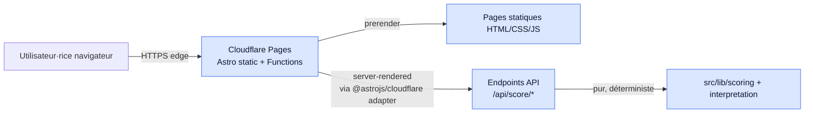
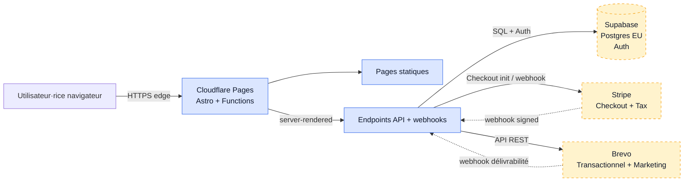

# Architecture — document vivant

> **Statut** : vivant — mis à jour à chaque spec qui touche l'infra.
> **Dernière mise à jour** : 2026-05-18 (création, spec 003).
>
> Ce document décrit **l'état courant** de l'architecture technique et la
> trajectoire planifiée à court terme. Il n'est pas une spec numérotée et
> n'a pas de cycle `proposé → validé → livré` — il reflète la réalité
> à l'instant T.

---

## 1. Vue d'ensemble runtime (état actuel)

**Sous-traitants actifs aujourd'hui :**

| Service | Rôle | Région data | Plan |
|---|---|---|---|
| Cloudflare Pages | Hébergement + edge functions + CDN + DNS | Edge global (EU prioritaire) | Free |
| GitHub | Hébergement code source + CI Actions | US | Free |

**Pas encore intégrés (planifiés specs 004/005) :**
- Supabase (auth + Postgres EU)
- Stripe (Checkout + Tax + Webhook)
- Brevo (email transactionnel + marketing automation)

## 2. Trajectoire — vue cible après specs 004 et 005

## 3. Matrice RGPD des sous-traitants

Pour chaque tiers : données traitées, base légale, localisation, et statut DPA.
À mettre à jour à l'introduction de chaque nouveau service.

| Tiers | Données | Base légale (RGPD art. 6) | Localisation | DPA |
|---|---|---|---|---|
| Cloudflare | Logs IP techniques, métriques de requêtes | Intérêt légitime — fonctionnement du site | Edge global, control plane US | Signable depuis dashboard CF |
| GitHub | Code source uniquement (aucune donnée utilisateur) | Intérêt légitime — outillage interne | US | DPA standard GitHub |
| Supabase *(à intégrer 004)* | Email utilisateur, identifiants chiffrés, résultats anonymisés | Exécution du contrat (achat) + intérêt légitime (compte) | EU (eu-west) | Signable depuis dashboard Supabase |
| Stripe *(à intégrer 004)* | Email, données de paiement (transitoires côté Stripe) | Exécution du contrat | EU pour traitement, US pour control plane | DPA Stripe |
| Brevo *(à intégrer 004)* | Email, statut consentement newsletter, événements engagement | Exécution du contrat (transactionnel) + consentement (newsletter) | EU (FR) | DPA Brevo |

**Procédure d'ajout d'un nouveau tiers (cf. CLAUDE.md §9)** :
1. La spec qui l'introduit met à jour ce tableau (ligne + tous les champs).
2. La politique de confidentialité du site est mise à jour dans la même PR.
3. Le DPA est signé avant le premier envoi de données réelles.
4. Le tiers est listé dans le bandeau cookies si pertinent.

## 4. Variables d'environnement

| Clé | Description | Scope | Introduite par |
|---|---|---|---|
| _(aucune V1)_ | — | — | — |

À mesure que des secrets/variables sont introduits (Supabase URL/key, Stripe
keys, Brevo API key), les lister ici **par nom uniquement**, jamais la
valeur. Les valeurs vivent dans le dashboard Cloudflare Pages (environment
variables) et dans `.env.local` côté dev — `.env*` est dans `.gitignore`.

## 5. Limites & contraintes techniques

- **Edge runtime Cloudflare** : pas tous les packages npm sont compatibles.
  Vérifier l'edge-compatibility avant d'ajouter une dépendance utilisée côté
  serveur (cf. CLAUDE.md §9). Les SDK courants compatibles : Stripe (officiel),
  Supabase (officiel, depuis 2024), Brevo (REST via fetch natif).
- **Cold starts** : edge functions Cloudflare ont des cold starts < 50 ms en
  pratique. Pas de stratégie de warm-up nécessaire à notre échelle.
- **Stripe webhook signature** : requiert `crypto` Web standard. Le SDK
  Stripe le gère ; on s'appuie dessus, on ne re-implémente pas.

## 6. Politique CI/CD

- **Build + déploiement** : déclenché automatiquement par Cloudflare Pages à
  chaque `push` GitHub (production sur `main`, preview deployments sur les
  autres branches). Pas de configuration dans le repo — connexion repo ↔ CF
  faite côté dashboard CF.
- **Qualité (gate de merge)** : `.github/workflows/ci.yml` — job `quality`
  (typecheck, lint, tests, build, E2E) + job `security` (OSV-Scanner,
  gitleaks). Status check `quality` requis pour merger sur `main` (à
  configurer manuellement dans les branch protection rules GitHub).
- **Pre-commit local** : `lefthook.yml` (typecheck, lint, tests sur
  fichiers changés) — déclenché à chaque `git commit`.
- **Pre-push local** : build complet (`astro build`) — pour s'assurer
  qu'aucun cassage du build ne part en remote.

## 7. Stack figée

La stack ci-dessous est figée. Tout changement passe par une spec dédiée.

| Couche | Choix |
|---|---|
| Framework | Astro 5 |
| UI dynamique | îlots React 18 |
| Styling | Tailwind CSS v4 |
| Langage | TypeScript 5 |
| Hébergement | Cloudflare Pages |
| Auth + DB *(à venir)* | Supabase |
| Paiement *(à venir)* | Stripe Checkout |
| Email *(à venir)* | Brevo |
| Tests unit/integration | Vitest 2 |
| Tests composants | @testing-library/react |
| Tests E2E | Playwright 1.x |
| Mocks réseau | MSW 2 |
| Sécurité deps | OSV-Scanner |
| Sécurité secrets | gitleaks |
| Lint | ESLint 9 + typescript-eslint + plugin-security |
| Pre-commit | lefthook |
| CI | GitHub Actions |
